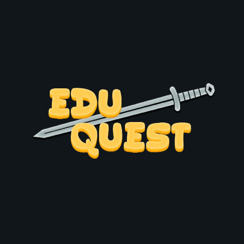

# EduQuest

## Description 
EduQuest is an innovative student e-learning platform where teachers can create classroom space and reward students for achievement. Teachers will be able to create questions and student groups along with viewing student marks/attendance. Students will be able to answer live questions posed by teachers, communicate with their peers, and submit essay questions via an interactive text box and file upload.

## Requirements

### Critical Priority
- Teacher and Student Account Creation
- Teachers can create courses/classroom environments
- Classroom environments are able to have a sign up link  or sign up code for each individual course
- Teacher can create questions visible to students for answering
- Multiple Choice & Written Questions
- Merge clicker sessions if same section, same course, same day

### Important
- Sorting questions into categories/units
- Visible timer, prof can add time
- Teacher can groups for collaborative solving of problems

### Nice to have
- Database to store student and teacher data (questions/answers, accounts, etc.)
- Weekly/Monthly Leaderboard -> Rewards for achievement
- Teachers can assign rewards either in person or digital badges/items
- Feature where questions can be for no marks (just a fun thing)
- System for generating a mock exam for a class
- Groups have messaging built into app

## Members
- Mark Lovesey - 32330540
- Ankkit Prakash - 44696284
- Daniel Penner - 54925359
- Nolan Nishikawa - 49988330
- Rhys Smith - 54103684 