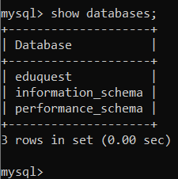
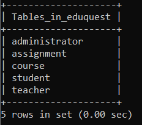

# Local System Database Instructions
### Disclaimer: I am aware that a large part of this has nothing to do with us pulling information from the database. However, it is still important to know have something to fall back on in order to run docker, as well as knowing that we have a working database. These commands also allow us to enter dummy information (of which there is already some) into the database in order to run proper testing with the backend code for things such as login authentication and whatnot. 
1. In terminal make sure to cd into the directory titled ```code```
2. Once in the ```code``` directory, make sure Docker is opened and run the command
```
docker-compose up -d
```
3. After this, then follow up with this command
```
docker exec -it eduquest bash
```
4. Once you are here, either run as testuser which is done by the command
```
mysql -u testuser -p
```
and then when prompted for a password, enter ```pw```

4. ASIDE - If you are running this through the root, then run the command
``` 
mysql -u root -p
```
and then when prompted for a password, enter ```rpw```

5. When in mysql, make sure you enter the database titled eduquest through the command
```
use eduquest;
```
6. Run the command ```show tables;``` when in in the eduquest database and check to see if ddl is implemented. If not (which is likely to be the case as this happened to me when establishing database), run the command
```
source docker-entrypoint-initdb.d/eduquest.sql
```
and if everything runs properly, it should say that rows have been affected, and when ```show tables;  ``` is ran, it should come up with the proper information from the schema. 

7. When done with database using database, use the command ```exit``` twice to quit out of the mysql section, and then in order to shut down the docker container completely and properly in order to avoid issues on next docker run, use the command
```
docker-compose down
```
# Images of just the database

* above image is what databases should be present if using testuser

* above image is to show what tables should be present in eduquest database

# Notes
* it should be noted that on first run, it is likely that the docker container might terminate on its own. If this does happen, then use the command ```docker-compose down``` and then start the process again